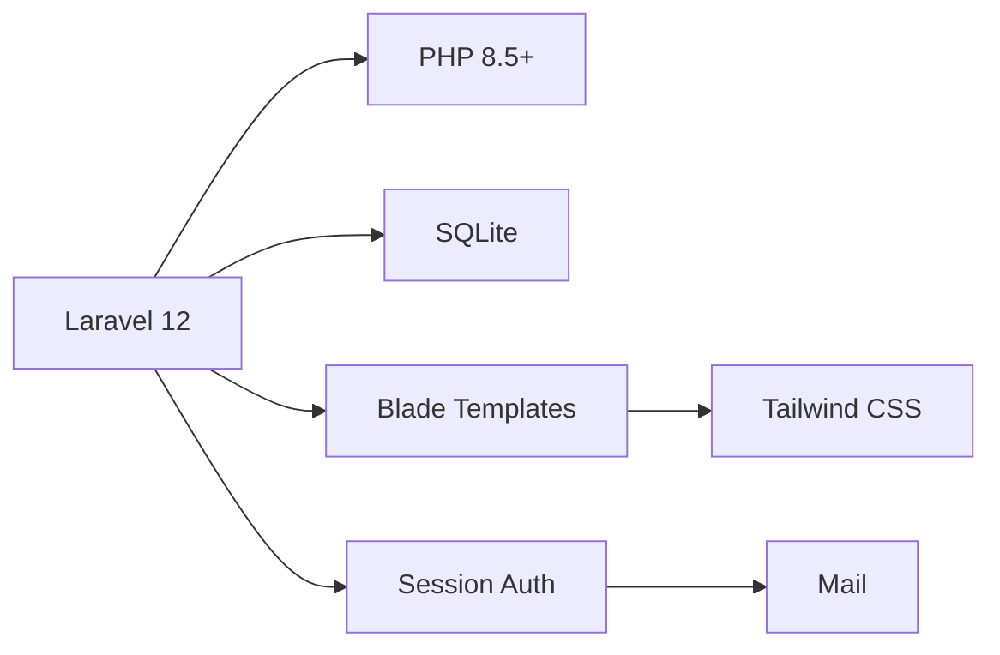

# 🏫 ASTU Digital Lost & Found System

<p align="center">
  <a href="#">
    
  </a>
  <a href="#">
    
  </a>
  <a href="#">
    
  </a>
  <a href="#">
    
  </a>
  <a href="#">
    
  </a>
</p>

<p align="center">
  
  
  
</p>

---

> 🔍 **A smart lost & found platform for ASTU students.** Report lost items, claim found items, and let our Text Similarity Engine (Jaccard + Cosine Similarity + TF-IDF + Edit Distance + N-grams) matching algorithm help you find what you're looking for.

---

## ✨ Features

### 🎓 For Students

| Feature | Description |
|---------|-------------|
| 📝 **Report Lost Items** | Post details about items you've lost with photos, location, and date |
| 📦 **Report Found Items** | Help others by reporting items you found on campus |
| 🔔 **Smart Matching** | Get notified via Email when similar items are found |
| 📋 **Claim System** | Request to claim items that match yours with proof |
| ⭐ **Trust Score** | Build your reputation through verified claims and returns |

### 🛡️ For Administrators

| Feature | Description |
|---------|-------------|
| 📊 **Dashboard** | Overview of all activities, stats, and recent actions |
| ✅ **Item Verification** | Approve/reject reported items before they go live |
| 👥 **User Management** | View, manage, and track user trust scores |
| 📈 **Reports & Analytics** | Insights on items, claims, and system usage |

### ⚡ Core Features

<p align="center">
  
  
  
</p>

- 🤖 **Similarity Matching** — Algorithm finds potential matches based on title, description, category, location, and date
- 📧 **Email Notifications** — Stay updated via email alerts
- 🔐 **Role-Based Access** — Separate student and admin interfaces

---

## 🛠️ Tech Stack



| Layer | Technology |
|-------|------------|
| **Backend** | Laravel 12 (PHP 8.5+) |
| **Database** | SQLite |
| **Frontend** | Blade Templates + Tailwind CSS |
| **Authentication** | Session-based (Laravel Built-in) |
| **Testing** | PHPUnit / Pest |
| **Notifications** | Mailtrap |

---

## 🗄️ Database Schema

```
┌──────────────────┐     ┌──────────────────┐     ┌──────────────────┐
│      users       │     │      items       │     │     claims       │
├──────────────────┤     ├──────────────────┤     ├──────────────────┤
│ 🔑 id            │     │ 🔑 id            │     │ 🔑 id            │
│ 👤 name          │     │ 📝 title         │     │ 📋 item_id       │
│ 📧 email         │     │ 📄 description   │     │ 👤 user_id       │
│ 🔐 password      │     │ 🏷️ category      │     │ 📊 similarity    │
│ 🎭 role          │◄────│ 📍 location      │     │ 📝 proof         │
│ ⭐ trust_score   │     │ 📅 item_date     │     │ ✅ status        │
│                  │     │   🔄 type         │     └────────┬─────────┘
└──────────────────┘     │ 🟢 status        │              │
                         │ 🖼️ image_path    │      ┌───────┴───────┐
                         │ 👤 user_id       │      │ claim_responses│
                         └──────────────────┘      ├──────────────────┤
                                                    │ 🔑 id            │
                         ┌──────────────────┐       │ 📋 claim_id     │
                         │ similarity_logs  │       │ 📱 finder_*     │
                         ├──────────────────┤       └──────────────────┘
                         │ 🔑 id            │
                         │ 📦 lost_item_id  │
                         │ 📦 found_item_id │
                         │ 📊 similarity_%  │
                         │ 🔔 notified     │
                         └──────────────────┘
```

---

## 🚀 Quick Start

### Prerequisites

> ⚠️ Make sure you have the following installed:

- ✅ PHP 8.2 or higher
- ✅ Composer
- ✅ MySQL 8.0+ or SQLite
- ✅ Node.js & npm
- ✅ Git

---

### Installation Steps

#### 1️⃣ Clone the Repository

```bash
git clone https://github.com/bilalshemsu1/astu-lost-found-system.git
cd astu-lost-found-system
```

#### 2️⃣ Install PHP Dependencies

```bash
composer install
```

#### 3️⃣ Install Node Dependencies

```bash
npm install
```

#### 4️⃣ Configure Environment

```bash
# Copy the example environment file
cp .env.example .env

# Generate application key
php artisan key:generate
```

#### 5️⃣ Edit `.env` File

```env
APP_NAME="ASTU Lost & Found"
APP_URL=http://localhost:8000

DB_CONNECTION=mysql
DB_HOST=127.0.0.1
DB_PORT=3306
DB_DATABASE=astu_lost_found
DB_USERNAME=root
DB_PASSWORD=your_password

# Optional: Mail
MAIL_MAILER=smtp
MAIL_HOST=mailpit
MAIL_PORT=1025
MAIL_USERNAME=null
MAIL_PASSWORD=null
```

#### 6️⃣ Create Database

```bash
# Login to MySQL
mysql -u root -p

# Create database
CREATE DATABASE astu_lost_found;
EXIT;
```

#### 7️⃣ Run Migrations

```bash
php artisan migrate
```

#### 8️⃣ (Optional) Seed Database

```bash
php artisan db:seed
```

#### 9️⃣ Build Frontend Assets

```bash
npm run build
```

#### 🔟 Start Development Server

```bash
php artisan serve
```

---

### 🎉 Access the Application

> Open your browser and visit: **http://localhost:8000**

---

## 📁 Project Structure

```
astu-lost-found-system/
├── 📂 app/
│   ├── 📂 Http/
│   │   ├── 📂 Controllers/
│   │   │   ├── 📂 Admin/           # Admin controllers
│   │   │   │   ├── ClaimsController.php
│   │   │   │   ├── DashboardController.php
│   │   │   │   ├── ItemsController.php
│   │   │   │   └── UsersController.php
│   │   │   ├── 📂 Auth/            # Authentication
│   │   │   │   └── AuthController.php
│   │   │   └── 📂 Student/         # Student controllers
│   │   │       ├── ClaimsController.php
│   │   │       ├── DashboardController.php
│   │   │       ├── ItemsController.php
│   │   │       └── MatchesController.php
│   │   └── 📂 Middleware/
│   ├── 📂 Models/                  # Eloquent models
│   │   ├── User.php
│   │   ├── Item.php
│   │   ├── Claim.php
│   │   └── SimilarityLog.php
│   ├── 📂 Services/                # Business logic
│   │   └── ItemMatcher.php        # Similarity algorithm
│   └── 📂 Providers/
├── 📂 database/
│   └── 📂 migrations/              # Database migrations
├── 📂 resources/
│   └── 📂 views/                   # Blade templates
│       ├── 📂 admin/               # Admin views
│       ├── 📂 student/             # Student views
│       └── 📂 auth/                # Auth views
├── 📂 routes/
│   └── web.php                     # Web routes
├── 📂 tests/
│   └── 📂 Feature/                # Feature tests
├── 📜 .env.example
├── 📜 composer.json
└── 📜 package.json
```

---

## 🔐 User Roles

| Role | Description | Permissions |
|------|-------------|-------------|
| 👨‍🎓 **Student** | Default registered users | Post items, claim items, view matches |
| 🛡️ **Admin** | System administrators | Verify items, manage users, view reports |

### Creating an Admin User

```bash
php artisan tinker
```

```php
App\Models\User::create([
    'name' => 'Admin',
    'email' => 'admin@astu.edu',
    'password' => bcrypt('password'),
    'role' => 'admin'
]);
```

---

## 🧪 Running Tests

```bash
# Run all tests
php artisan test

# Run specific test file
php artisan test tests/Feature/SimilarityMatchNotificationTest.php

# Run with coverage
php artisan test --coverage
```

---

## 📝 API Endpoints

| Method | Endpoint | Description | Auth |
|--------|----------|-------------|------|
| GET | `/` | Home page | ❌ |
| GET | `/login` | Login form | ❌ |
| POST | `/login` | Login submit | ❌ |
| GET | `/register` | Register form | ❌ |
| POST | `/register` | Register submit | ❌ |
| GET | `/student/dashboard` | Student dashboard | ✅ Student |
| POST | `/items/lost` | Post lost item | ✅ Student |
| POST | `/items/found` | Post found item | ✅ Student |
| GET | `/items` | View all items | ✅ Student |
| GET | `/matches` | View matches | ✅ Student |
| POST | `/claim/{item}` | Submit claim | ✅ Student |
| GET | `/admin` | Admin dashboard | ✅ Admin |
| GET | `/admin/users` | Manage users | ✅ Admin |
| GET | `/admin/items` | Verify items | ✅ Admin |


## 🌍 Deployment

### Production Deployment (EC2)

```bash
# Update server
sudo apt update && sudo apt upgrade -y

# Install LAMP stack
sudo apt install -y apache2 mysql-server php8.2 php8.2-mysql

# Clone repo
cd /var/www
sudo git clone https://github.com/bilalshemsu1/astu-lost-found-system.git

# Configure Apache
sudo nano /etc/apache2/sites-available/astu-lost-found.conf
```

```apache
<VirtualHost *:80>
    ServerName your-domain.com
    DocumentRoot /var/www/astu-lost-found-system/public
    
    <Directory /var/www/astu-lost-found-system>
        AllowOverride All
    </Directory>
</VirtualHost>
```

```bash
# Enable site and restart
sudo a2ensite astu-lost-found
sudo systemctl restart apache2
```

## 🙏 Acknowledgments

- 🏛️ **ASTU University** for the inspiration
- 🛠️ **Laravel Community** for the amazing framework
- 🎨 **Tailwind CSS** for beautiful styling
- 🤝 All contributors who help improve this project


## 👤 Author

<p align="center">
  <a href="https://github.com/bilalshemsu1">
    
  </a>
  <a href="https://t.me/bilalshemsu">
    
  </a>
  <a href="mailto:bilalshemsu4@gmail.com">
    
  </a>
</p>

<p align="center">
  <strong>Bilal Shemsu</strong><br>
  <sub>Full Stack Developer | Laravel | ASTU Student</sub>
</p>

---

<p align="center">
  ⭐️ If you found this project useful, please consider giving it a star!
</p>

<p align="center">
  Made with ❤️ for ASTU Students
</p>

---

<!-- MARKDOWN LINKS -->
[license-shield]: https://img.shields.io/badge/License-MIT-green?style=for-the-badge
[license-url]: https://github.com/bilalshemsu1/astu-lost-found-system/blob/main/LICENSE
[stars-shield]: https://img.shields.io/github/stars/bilalshemsu1/astu-lost-found-system?style=for-the-badge
[stars-url]: https://github.com/bilalshemsu1/astu-lost-found-system/stargazers
[forks-shield]: https://img.shields.io/github/forks/bilalshemsu1/astu-lost-found-system?style=for-the-badge
[forks-url]: https://github.com/bilalshemsu1/astu-lost-found-system/network/members
